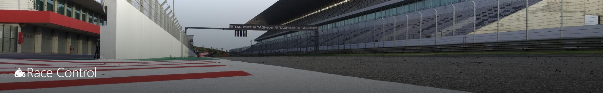

| Nombre  | ruta |
| ------ | ------ |
|All clases |[ Ver Todas las Clases](./class.md)|
|Car|[ir a Car.class](./src/main/java/com/bieitosousa/campusdual/DATA/Car.md)|
|Garage|[ir a Garage.class](./src/main/java/com/bieitosousa/campusdual/DATA/Garage.md)|
|Race|[ir a Race.class](./src/main/java/com/bieitosousa/campusdual/DATA/Race.md)|
|WORK WHITH GSON LIBREARY |[ir a JSON.class](./src/main/java/com/bieitosousa/campusdual/UTILS/JSON.md)|
|archivos|[ir cars.json](./cars.json)|
|Race_Elimination |[ ir a Race_Elimination.class ](./src/main/java/com/bieitosousa/campusdual/DATA/Race_Elimination.md)|
|Race_Race_Standar|[ ir a Race_Standar.class ](./src/main/java/com/bieitosousa/campusdual/DATA/Race_Standar.md)|

## Se desea crear un programa para controlar todo el ciclo de la celebración de eventos automovilísticos

##### 1. Control tiene una lista de carreras

##### 2. En las carreras participan una serie de coches, que están adscritos a un garaje

##### 3. En los garajes se registran los coches participantes en una carrera

##### 4. Cada coche tendrá una marca y un modelo. Todos los coches tendrán la misma velocidad máxima (Seat 600 o Mazda MX5, la misma)

##### 5. Los garajes tendrán el nombre de la escudería a la que representan (McLaren-Mercedes)

##### 6. Las carreras tendrán un nombre del premio que se sortea (GP de Indianápolis)

##### 7. Desde el control, se podrán manejar todas las careras

##### 8. Una carrera "estándar" dura 3 horas.

##### 9. El resultado de una carrera "estándar" consistirá en el podio (1º, 2º, y 3º)

##### 10. Una carrera "de eliminación" tendrá N coches, y consistirá en N-1 vueltas

##### 11. Se podrán crear torneos, 1 para cada tipo de carrera.

##### 12. Cada torneo consiste en 10 carreras.

##### 13. Para los torneos, se llevará una puntuación. Sólo puntuarán los 3 primeros en las careras estándar o de eliminación

##### 14. El ganador del torneo será el coche que más puntos tenga al finalizar el torneo. En caso de empate, se divide el premio.

##### 15. Se pueden crear carreras y torneos para un garaje específico o para todos los garajes a la vez.

##### 16. Si se seleccionan todos los garajes, se seleccionará un coche aleatorio de todos los que tenga registrados dicho garaje

##### 17. Los torneos sólo se pueden llevar a cabo si no hay ninguna carrera ni ningún otro torneo simultáneamente.

##### 18. Los garajes podrán registrar coches de manera masiva leyendo un fichero

##### 19. Los resultados de una carrea o torneo, y sus participantes, podrán ser exportados en un fichero de texto, junto con la clasificación.

##### 20. Exportar e importar el estado del programa. Cada vez que se ejecute el programa, podremos leer un fichero que contenga todos los torneos, carreras, garajes y coches registrados en la aplicación

##### 21. Hace falta simular el resultado de las carreras de una forma sencilla. Por ejemplo, el comportamiento de los coches se puede simplificar a acelerar o frenar aleatoriamente cada cierto tiempo, donde acelerar supone aumentar de forma instantánea la velocidad una cantidad fija, y frenar supone disminuir la velocidad del coche de forma instantánea otra cantidad fija. Esas cantidades no son determinadas en función de la cinemática, si no que son fijas independientemente del esfuerzo de aceleración que suponga el coche en ese instante.

##### 22. Para simplificar el podio de una carrera estándar, suponemos que el coche que más distancia ha recorrido ha sido el coche más rápido y de manera descendente obtenemos el podio

##### 23. Para una carrera de eliminación, el coche que menos distancia recorra en una vuelta, quedará eliminado

##### 24. Cada vuelta al circuito dura 1 minuto.
